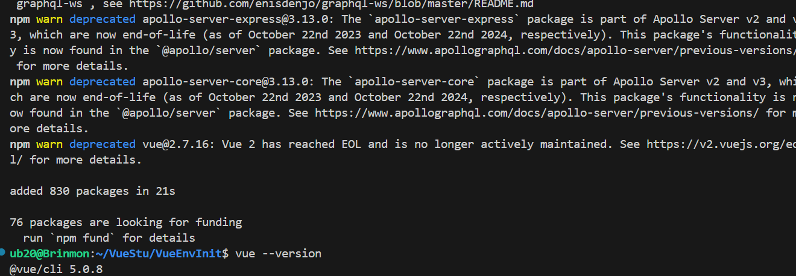
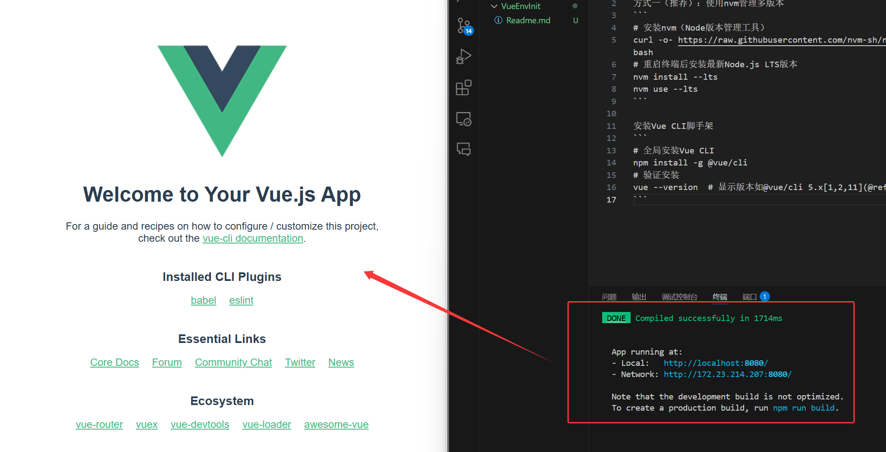

## 环境配置
Vue开发依赖于Node.js环境，建议通过以下两种方式安装：
​​方式一（推荐）：使用nvm管理多版本
```
# 安装nvm（Node版本管理工具）
curl -o- https://raw.githubusercontent.com/nvm-sh/nvm/v0.39.1/install.sh | bash
# 重启终端后安装最新Node.js LTS版本
nvm install --lts
nvm use --lts
```

安装Vue CLI脚手架​
```
# 全局安装Vue CLI
npm install -g @vue/cli
# 验证安装
vue --version  # 显示版本如@vue/cli 5.x[1,2,11](@ref)
```



## 简单开发项目
创建Vue项目​
```
# 初始化项目（选择默认配置）
vue create shop-demo
# 进入项目目录
cd shop-demo
# 启动开发服务器
npm run serve
```

创建的项目不可以有大写字母：
```
ub20@Brinmon:~/VueStu/VueEnvInit$ vue create Vue_Day1
Invalid project name: "Vue_Day1"
Warning: name can no longer contain capital letters
```

成功启动：



```
ub20@Brinmon:~/VueStu/vue_day1$ tree 
.
└── src
    ├── App.vue
    ├── assets
    │   └── logo.png
    ├── components
    │   └── ProductCard.vue
    ├── data
    │   └── products.json
    └── main.js
```

## 创建数据
在 `src` 目录下新建 `data/products.json`，编写静态商品数据：
vue_day1/src/data/products.json
```json
[
    { "id": 1, "title": "Vue教程", "price": 99 },
    { "id": 2, "title": "TypeScript指南", "price": 89 }
]
```

## 创建商品展示组件​
在 `src/components` 下新建 `ProductCard.vue`：
vue_day1/src/components/ProductCard.vue
```vue
<template>
  <div class="product-card">
    <h3>{{ product.title }}</h3>
    <p>价格：{{ product.price }}元</p>
  </div>
</template>

<script>
export default {
  name: 'ProductCard',
  props: {
    product: {
      type: Object,
      required: true
    }
  }
}
</script>
```

## 在App.vue中渲染列表​
修改 `src/App.vue`，使用 `v-for` 循环数据：
vue_day1/src/App.vue
```vue
<template>
  <div id="app">
    <h1>商品列表</h1>
    <div v-for="product in products" :key="product.id">
      <ProductCard :product="product" />
    </div>
  </div>
</template>

<script>
import ProductCard from './components/ProductCard.vue'
import products from './data/products.json'

export default {
  name: 'App',
  components: { ProductCard },
  data() {
    return {
      products: products
    }
  }
}
</script>
```


## 展示成功
```
npm run serve
```


