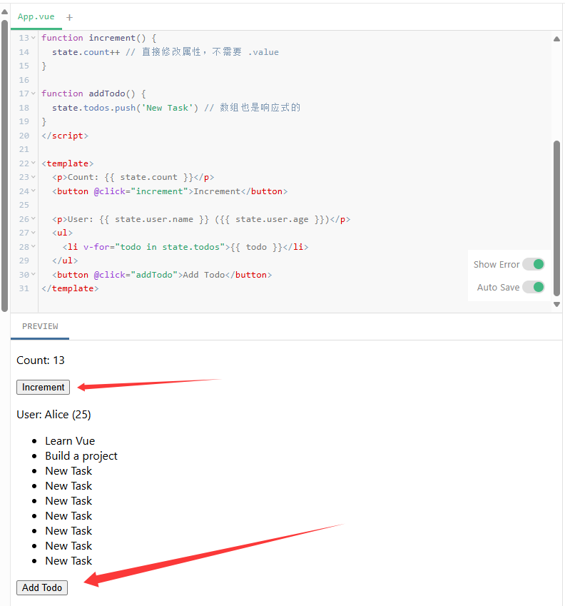
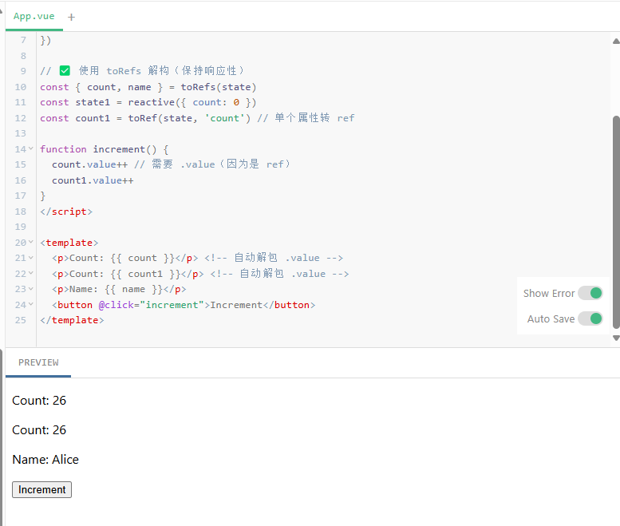

交互式网页版教程：[教程 | Vue.js](https://cn.vuejs.org/tutorial/#step-1)
Vue详细文档：[简介 | Vue.js](https://cn.vuejs.org/guide/introduction)


Vue的页面构成，可以理解为main.html：主页面是App.vue
```vue
<template>
  <h1>Hello World!</h1>
</template>
```
使用template包裹起来！

## **1. `reactive`（响应式对象）**
`reactive` 用于创建一个**响应式对象**（包括数组、`Map`、`Set` 等），适用于**复杂数据结构**（如对象或数组）。

**特点**
- 只能用于**对象类型**（`Object`、`Array`、`Map`、`Set` 等），不能用于原始值（如 `number`、`string`、`boolean`）。
- 返回一个 Proxy 对象，Vue 会自动跟踪其属性的变化，并且进行重新渲染
- 修改属性时**不需要 `.value`**，直接赋值即可。

### **Proxy 的拦截机制​**
Vue 3 使用 JavaScript 的 `Proxy` 对象包裹原始对象，通过拦截属性的 ​**​读取（get）​**​ 和 ​**​修改（set）​**​ 操作，实现依赖收集和触发更新：
- ​**​`get` 拦截​**​：当访问属性（如 `state.count`）时，Proxy 会记录当前正在运行的副作用（如组件的渲染函数或 `effect`），建立依赖关系
- ​**​`set` 拦截​**​：当修改属性（如 `state.count = 1`）时，Proxy 会通知所有关联的副作用重新执行，触发视图更新
```
const state = reactive({ count: 0 });
// 访问 state.count → 收集依赖
// 修改 state.count → 触发更新
```
当检测到数据修改后会触发**依赖收集（Track）​**和**触发更新（Trigger）** 进行快速的重新渲染组件！


### reactive测试案例
```vue
<script setup>
import { reactive } from 'vue'

const state = reactive({
  count: 0,
  user: {
    name: 'Alice',
    age: 25
  },
  todos: ['Learn Vue', 'Build a project'] //需要进行的任务
})

function increment() {
  state.count++ // 直接修改属性，不需要 .value
}

function addTodo() {
  state.todos.push('New Task') // 数组也是响应式的，向todos数组添加数据
}
</script>

<template>
  <p>Count: {{ state.count }}</p>
  <button @click="increment">Increment</button>

  <p>User: {{ state.user.name }} ({{ state.user.age }})</p>
  <ul>
    <li v-for="todo in state.todos">{{ todo }}</li>
  </ul>
  <button @click="addTodo">Add Todo</button>
</template>
```

Vue添加按钮和js进行动态交互，Vue的script，可以理解为js

**reactive适用场景**
- 当需要管理**复杂状态**（如对象、数组）时。
- 当多个属性需要一起管理时（如 `user.name`、`user.age`）。


可以实现动态的添加数据：



## **2. `ref`（响应式引用）**
`ref` 用于创建一个**响应式引用**，适用于**基本类型**（如 `number`、`string`、`boolean`），也可以用于对象。

**特点**
- 可以用于**任何类型**（基本类型、对象、数组等）。
- 返回一个带有 `.value` 属性的对象，访问或修改数据时需要使用 `.value`。
- 在 `<template>` 中**自动解包**，不需要写 `.value`。


### ref测试案例
```vue
<script setup>
import { ref } from 'vue'

const count = ref(0) // 基本类型
const user = ref({ name: 'Bob', age: 30 }) // 对象也可以

function increment() {
  count.value++ // 必须用 .value 修改
}

function updateUser() {
  user.value.age = 332 // 修改对象属性也要用 .value
}
</script>

<template>
  <p>Count: {{ count }}</p> <!-- 自动解包，不需要 .value -->
  <button @click="increment">Increment</button>

  <p>User: {{ user.name }} ({{ user.age }})</p> <!-- 自动解包 -->
  <button @click="updateUser">Update Age</button>
</template>
```

**适用场景**
- 当需要管理**单个基本类型值**（如 `count`、`isLoading`）时。
- 当需要**重新赋值整个对象**时（如 `user.value = { ... }`）。


## **3.`reactive` vs `ref` 对比**

| 特性       | `reactive`                        | `ref`                          |
| -------- | --------------------------------- | ------------------------------ |
| **适用类型** | 仅对象（`Object`、`Array`、`Map`、`Set`） | 任何类型（基本类型、对象等）                 |
| **访问方式** | 直接访问（`state.count`）               | 需要 `.value`（`count.value`）     |
| **模板使用** | 直接使用（`{{ state.count }}`）         | 自动解包（`{{ count }}`）            |
| **重新赋值** | 不能直接替换整个对象（需用 `Object.assign`）    | 可以重新赋值（`ref.value = newValue`） |
| **适用场景** | 复杂状态（多个属性）                        | 单个值或需要重新赋值的对象                  |
如何选择？
- **用 `reactive`**：当你要管理一个**复杂对象**（如 `form` 表单数据、嵌套对象）。
- **用 `ref`**：当你要管理**基本类型**（如 `count`、`isLoading`），或者需要**重新赋值整个对象**。


**`ref` 更通用，`reactive` 更适用于对象**

Vue 官方推荐：
- **优先使用 `ref`**，因为它更灵活，适用于所有情况。
- 如果是一个**复杂对象**，可以使用 `reactive` 减少 `.value` 的使用。

## **4.额外技巧**
### **1. `ref` 可以用于对象**
```vue
<script setup>
import { ref } from 'vue'

// 使用 ref 包装对象（内部自动调用 reactive）
const state = ref({
  count: 0,
  user: {
    name: 'Alice',
    age: 25
  },
  todos: ['Learn Vue', 'Build a project']
})

function increment() {
  state.value.count++ // 修改时需要 .value
}

function addTodo() {
  state.value.todos.push('New Task') // 数组操作也需要 .value
}
</script>

<template>
  <p>Count: {{ state.count }}</p> <!-- 模板中自动解包 .value -->
  <button @click="increment">Increment</button>

  <p>User: {{ state.user.name }} ({{ state.user.age }})</p>
  <ul>
    <li v-for="todo in state.todos">{{ todo }}</li>
  </ul>
  <button @click="addTodo">Add Todo</button>
</template>
```

### **2. `reactive` 不能直接替换整个对象**​
#### ​**​1. 使用 `ref` 替换整个对象（✅ 保持响应性）​**
```vue
<script setup>
import { ref } from 'vue'

const user = ref({
  name: 'Alice',
  age: 25
})

function replaceUser() {
  // ✅ 直接替换整个对象（保持响应性）
  user.value = {
    name: 'Bob',
    age: 30
  }
}
</script>

<template>
  <p>Name: {{ user.name }}, Age: {{ user.age }}</p>
  <button @click="replaceUser">Replace User (ref)</button>
</template>
```

#### **2.使用`reactive` 替换整个对象也能保持响应性**
```vue
<script setup>
import { reactive } from 'vue'

let user = reactive({
  name: 'Alice',
  age: 25
})

function replaceUser() {
  // ❌ 直接替换整个对象（失去响应性）
  // 即使赋值了，UI 也不会更新！
  //user = {
  //  name: 'Bob',
  //  age: 30
  //}
  // ✅ 修改原对象（保持响应性）
  Object.assign(user, {
    name: 'Bob',
    age: 30
  })
}
</script>

<template>
  <p>Name: {{ user.name }}, Age: {{ user.age }}</p>
  <button @click="replaceUser">Replace User (reactive)</button>
</template>
```


### **3. `toRefs` 解构 `reactive`**
```vue
<script setup>
import { reactive, toRefs ,toRef } from 'vue'

const state = reactive({
  count: 0,
  name: 'Alice'
})

// ✅ 使用 toRefs 解构（保持响应性）
const { count, name } = toRefs(state)
const state1 = reactive({ count: 0 })
const count1 = toRef(state, 'count') // 单个属性转 ref

function increment() {
  count.value++ // 需要 .value（因为是 ref）
  count1.value++
}
</script>

<template>
  <p>Count: {{ count }}</p> <!-- 自动解包 .value -->
  <p>Count: {{ count1 }}</p> <!-- 自动解包 .value -->
  <p>Name: {{ name }}</p>
  <button @click="increment">Increment</button>
</template>
```
- ​**​直接用 `reactive` 解构 → 失去响应性​**​
- ​**​用 `toRefs` 解构 → 保持响应性（需 `.value`）​**​
- ​**​用 `toRef` → 单个属性转换​**
可以显示：


## 5.复杂案例
```vue
<script setup>
import { ref, reactive, computed } from 'vue'

// 1. 使用 ref 声明响应式数据（基本类型 + 对象）
const message = ref('Hello, Vue 3!')
const counter = reactive({
  count: 0,
  history: [] // 记录历史操作
})

// 2. 计算属性（基于响应式数据动态计算）
const reversedMessage = computed(() => {
  return message.value.split('').reverse().join('')
})

// 3. 方法：修改状态
function increment() {
  counter.count++
  counter.history.push(`Incremented to ${counter.count}`)
}

function decrement() {
  counter.count--
  counter.history.push(`Decremented to ${counter.count}`)
}

function reset() {
  counter.count = 0
  counter.history.push('Reset to 0')
}

function updateMessage() {
  message.value = 'Updated: ' + new Date().toLocaleTimeString()
}
</script>

<template>
  <!-- 1. 直接渲染 ref（自动解包 .value） -->
  <h1>{{ message }}</h1>
  
  <!-- 2. 在模板中使用 JavaScript 表达式 -->
  <h2>Reversed: {{ message.split('').reverse().join('') }}</h2>
  <h2>Computed Reversed: {{ reversedMessage }}</h2>
  
  <!-- 3. 渲染 reactive 对象的属性 -->
  <p>Count: {{ counter.count }}</p>
  
  <!-- 4. 调用方法修改状态 -->
  <button @click="increment">+1</button>
  <button @click="decrement">-1</button>
  <button @click="reset">Reset</button>
  <button @click="updateMessage">Update Message</button>
  
  <!-- 5. 渲染历史记录（数组遍历） -->
  <ul>
    <li v-for="(item, index) in counter.history" :key="index">
      {{ item }}
    </li>
  </ul>
</template>
```