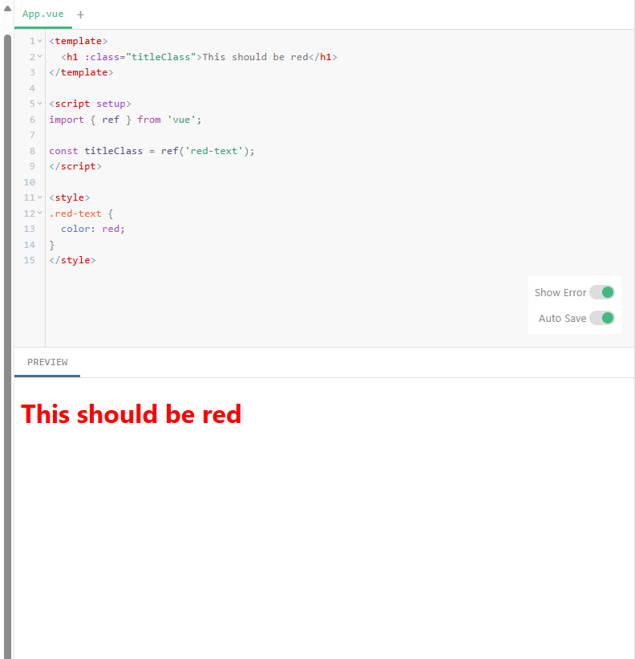
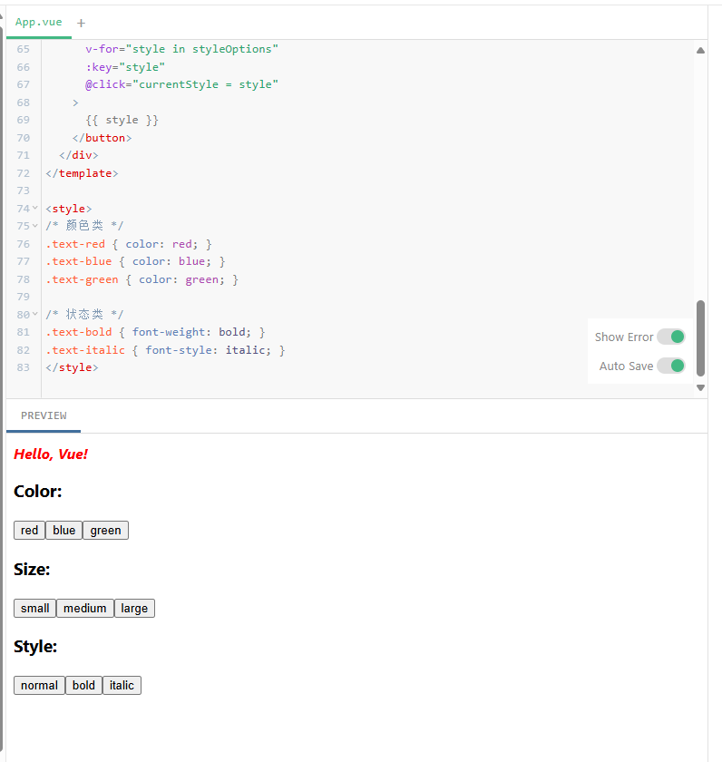

## Vue Attribute 绑定学习
关键概念：
1. **Mustache语法限制**：双大括号 `{{ }}` 只能用于文本插值，不能用于HTML属性
2. **v-bind指令**：用于动态绑定属性值
	- 完整语法：`v-bind:attribute="expression"`
	- 简写语法：`:attribute="expression"`


**动态绑定示例**
```vue
<template>
  <h1 :class="titleClass">This should be red</h1>
</template>

<script setup>
import { ref } from 'vue';

const titleClass = ref('red-text');
</script>

<style>
.red-text {
  color: red;
}
</style>
```

实际案例：



## 动态样式绑定案例
```vue
<script setup>
import { ref, computed } from 'vue'

// 1. 定义可选的样式状态
const colorOptions = ['red', 'blue', 'green']
const sizeOptions = ['small', 'medium', 'large']
const styleOptions = ['normal', 'bold', 'italic']

// 2. 响应式变量存储当前选择
const currentColor = ref('red')
const currentSize = ref('medium')
const currentStyle = ref('normal')

// 3. 计算属性生成动态 class 和 style
const textClass = computed(() => ({
  // 颜色用 class 控制（CSS 预定义）
  [`text-${currentColor.value}`]: true,
  // 样式状态用 class 控制
  'text-bold': currentStyle.value === 'bold',
  'text-italic': currentStyle.value === 'italic'
}))

const textStyle = computed(() => ({
  // 大小用内联 style 控制（更灵活）
  fontSize: 
    currentSize.value === 'small' ? '12px' :
    currentSize.value === 'medium' ? '16px' : '24px'
}))
</script>

<template>
  <!-- 动态绑定 class 和 style -->
  <h1 :class="textClass" :style="textStyle">
    Hello, Vue!
  </h1>

  <!-- 颜色控制按钮 -->
  <div>
    <h3>Color:</h3>
    <button 
      v-for="color in colorOptions" 
      :key="color"
      @click="currentColor = color"
    >
      {{ color }}
    </button>
  </div>

  <!-- 大小控制按钮 -->
  <div>
    <h3>Size:</h3>
    <button 
      v-for="size in sizeOptions" 
      :key="size"
      @click="currentSize = size"
    >
      {{ size }}
    </button>
  </div>

  <!-- 样式状态控制按钮 -->
  <div>
    <h3>Style:</h3>
    <button 
      v-for="style in styleOptions" 
      :key="style"   //如果没有它，虽然代码可能仍能运行，但会存在潜在问题（如动态列表的顺序错乱）
      @click="currentStyle = style"  //执行变量赋值操作
    >
      {{ style }}
    </button>
  </div>
</template>

<style>
/* 颜色类 */
.text-red { color: red; }
.text-blue { color: blue; }
.text-green { color: green; }

/* 状态类 */
.text-bold { font-weight: bold; }
.text-italic { font-style: italic; }
</style>
```

显示设计：
