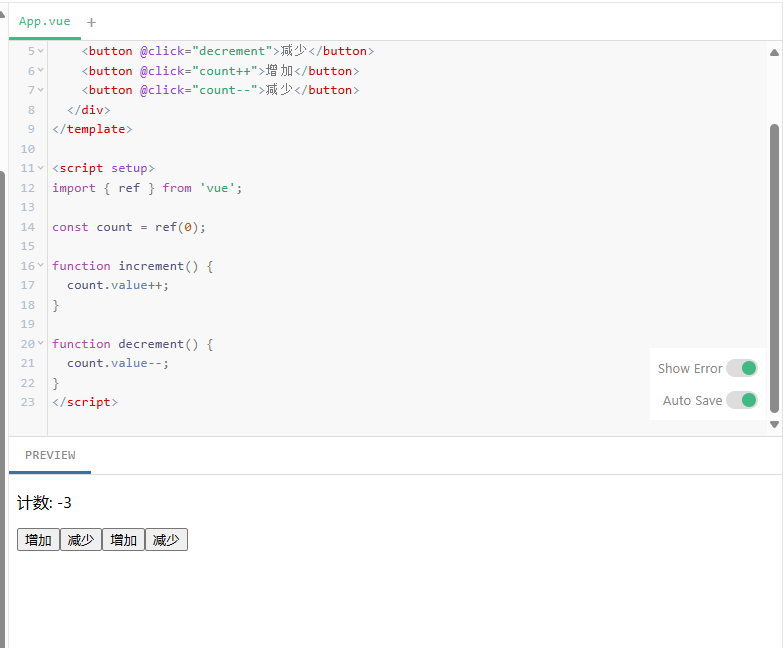

## 初级：基础事件监听
Vue 使用 `v-on` 指令监听 DOM 事件，简写为 `@`
```
<button v-on:click="handler">点击我</button>
<!-- 简写形式 -->
<button @click="handler">点击我</button>
```

计算案例：
```vue
<template>
  <div>
    <p>计数: {{ count }}</p>
    <button @click="increment">增加</button>
    <button @click="decrement">减少</button>
    <button @click="count++">增加</button>
    <button @click="count--">减少</button>
  </div>
</template>

<script setup>
import { ref } from 'vue';

const count = ref(0);

function increment() {
  count.value++;
}

function decrement() {
  count.value--;
}
</script>
```




## 中级：事件修饰符和参数传递
### 1. 事件修饰符
Vue 提供事件修饰符来实现常见的事件处理需求
```vue
<!-- 阻止默认行为 -->
<form @submit.prevent="onSubmit"></form>

<!-- 停止事件冒泡 -->
<div @click.stop="doThis"></div>

<!-- 事件只触发一次 -->
<button @click.once="doThis"></button>

<!-- 按键修饰符 -->
<input @keyup.enter="submit" />
```
1️⃣ `@submit.prevent="onSubmit"`
✅ 功能：阻止表单的默认提交行为
在 HTML 中，`<form>` 提交会默认刷新页面或跳转，如果你是单页应用（SPA），你往往不想让它跳转。
✅ 使用场景：
+ 提交表单时不希望页面刷新
+ 使用 JavaScript 处理数据上传

2️⃣ `@click.stop="doThis"`
✅ 功能：阻止事件冒泡
事件在 DOM 中是会“冒泡”的：子元素触发点击后，事件会向上传递到父元素。
✅ 使用场景：
- 防止点击事件传到父组件或祖先元素
- 比如点击一个弹窗中的按钮时，不想让整个页面的点击事件被触发（如关闭弹窗）

3️⃣ `@click.once="doThis"`
✅ 功能：事件只触发一次
`.once` 修饰符表示该事件监听器 **只会生效一次**，执行完就解绑。
✅ 使用场景：
- “确认操作”按钮只能点击一次
- 首次触发某种动画或提示后不再重复执行

4️⃣ `@keyup.enter="submit"`
✅ 功能：按下某个特定键时才触发
Vue 提供了一些常见按键的别名修饰符，如：
- `.enter`、`.esc`、`.tab`、`.delete`、`.space`、`.up`、`.down`、`.left`、`.right` 等
✅ 使用场景：
- 实现“按回车提交表单”的行为
- 输入框中用快捷键触发某些功能

🔚 小结表格

|修饰符|功能简述|原生 JS 等价方法|
|---|---|---|
|`.prevent`|阻止默认行为|`event.preventDefault()`|
|`.stop`|阻止事件冒泡|`event.stopPropagation()`|
|`.once`|事件仅触发一次|`{ once: true }` 或手动解绑|
|`.enter`|特定按键触发事件|`if (event.key === 'Enter')`|

### 2. 传递事件参数

```
<template>
  <button @click="sayHello('Vue')">打招呼</button>
</template>

<script setup>
function sayHello(name) {
  alert(`Hello, ${name}!`);
}
</script>
```
### 3. 访问原生事件
使用 `$event` 变量或箭头函数传递事件对象
```
<button @click="warn('Form cannot be submitted.', $event)">
  提交
</button>

<!-- 或使用箭头函数 -->
<button @click="(event) => warn('Form cannot be submitted.', event)">
  提交
</button>
```

### 结合案例
```vue
<template>
  <div @click="handleDivClick">
    <form @submit.prevent="handleSubmit">
      <label>
        昵称：
        <input v-model="nickname" />
      </label>
      <br />
      <label>
        留言：
        <textarea v-model="message"></textarea>
      </label>
      <br />
      <!-- 阻止冒泡 + 传递参数 + 访问事件对象 -->
      <button 
        @click.stop="handleClick(nickname, $event)"
        type="submit"
      >
        提交留言
      </button>
    </form>
  </div>
</template>

<script setup>
import { ref } from 'vue'

const nickname = ref('')
const message = ref('')

// 阻止父级div响应点击
function handleClick(name, event) {
  if (!name || !message.value) {
    alert('请填写昵称和留言！')
    event.preventDefault() // 双保险
  } else {
    alert(`感谢你的留言，${name}！`)
    console.log('事件对象:', event)
  }
}

// 模拟外层点击事件
function handleDivClick() {
  console.log('外层 div 被点击了（如果事件冒泡没被阻止）')
}

function handleSubmit() {
  console.log('表单已提交（被 @submit.prevent 阻止默认行为）')
}
</script>

```
`v-model` 是 Vue 提供的一个 **双向绑定指令**，它的作用是：**让数据和表单控件的值保持同步**。


