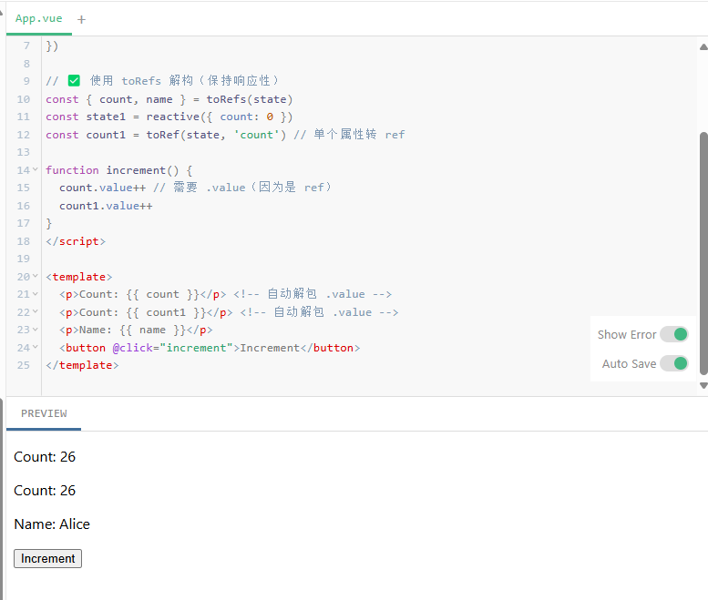

# 的Vue学习项目

这是一个Vue.js的学习项目，包含从基础到进阶的多个实践案例。

## 项目结构

```
VueStu/
├── Docs/                  # 学习笔记文档
│   ├── Day1-环境搭建和简单的页面.md
│   ├── Day2.1-声明式渲染.md
│   ├── Day2.2-Attribute 绑定.md
│   ├── ... (其他学习笔记)
│   └── attachment/        # 文档相关图片
├── vue_day1/              # Vue基础项目
│   ├── src/
│   │   ├── App.vue        # 主组件
│   │   ├── components/    # 组件目录
│   │   └── data/          # 数据文件
├── vue_day2/              # Vue进阶项目
│   ├── src/
│   │   ├── components/    # 各种表单组件
│   │   └── store/         # Vuex状态管理
└── vue_day3/              # Vue高级项目
    ├── src/
    │   ├── router/        # 路由配置
    │   ├── store/         # Vuex配置
    │   └── views/         # 路由页面
```

## 子项目介绍

### vue_day1 - Vue基础
- 环境搭建
- 简单的页面渲染
- 产品卡片组件示例

### vue_day2 - Vue进阶
- 表单绑定
- 自定义指令
- Vuex状态管理

### vue_day3 - Vue高级
- Composition API
- Vue Router
- TodoList示例

## 学习文档

在`Docs/`目录下包含了详细的学习笔记，记录了从环境搭建到各个Vue特性的学习过程。

## 运行项目

每个子项目都可以独立运行：

```bash
cd vue_day1  # 或vue_day2/vue_day3
npm install
npm run serve
```

## 截图示例



